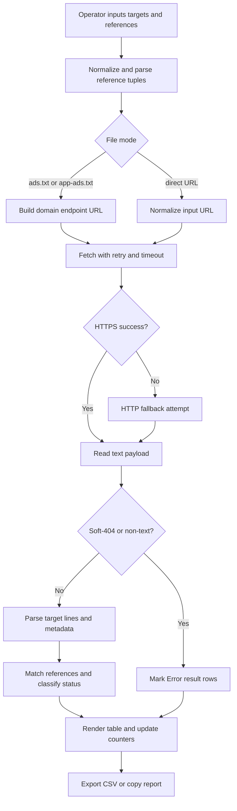

# Inventory Auth Auditor

Enterprise-grade Chrome extension for high-volume `ads.txt` / `app-ads.txt` authorization auditing with resilient fetch logic, deterministic line matching, and export-ready operational reporting.

[](manifest.json)
[](#testing)
[](#testing)
[](manifest.json)
[](LICENSE)

> [!IMPORTANT]
> This project performs semantic, line-level inventory authorization validation, not simple file-presence checks.

## Table of Contents

- [Title and Description](#inventory-auth-auditor)
- [Table of Contents](#table-of-contents)
- [Features](#features)
- [Tech Stack & Architecture](#tech-stack--architecture)
  - [Core Stack](#core-stack)
  - [Project Structure](#project-structure)
  - [Key Design Decisions](#key-design-decisions)
- [Getting Started](#getting-started)
  - [Prerequisites](#prerequisites)
  - [Installation](#installation)
- [Testing](#testing)
- [Deployment](#deployment)
- [Usage](#usage)
- [Configuration](#configuration)
- [License](#license)
- [Contacts & Community Support](#contacts--community-support)

## Features

- High-throughput validation engine for `ads.txt`, `app-ads.txt`, and direct URL mode.
- Batch-based parallel execution with configurable concurrency control (`1`–`5` targets per batch).
- Deterministic tuple validation against reference rows (`domain`, `publisher-id`, `account-type`).
- Partial-match diagnostics for account type mismatch detection.
- Dual protocol retrieval strategy (`https://` fallback to `http://`) for resilience across heterogeneous publisher infrastructure.
- Retry-enabled fetch with timeout control and transient-failure backoff.
- Soft-404 detection to reject HTML/JSON/XML responses masquerading as text inventory files.
- Input normalization pipeline:
  - strips comments,
  - removes zero-width characters,
  - normalizes case,
  - supports optional `TAG-ID` parsing.
- Duplicate logical-line detection in target files.
- Metadata enrichment for `OWNERDOMAIN` and `MANAGERDOMAIN`.
- Two reporting layouts:
  - `Standard` (row-level reference checks),
  - `Grouped by Target` (target-centric matrix output).
- Triage-first filtering mode (`Errors / Warnings Only`).
- In-session and persistent UX state via `chrome.storage.local`.
- Export and handoff tooling:
  - CSV generation,
  - clipboard copy (tab-delimited).
- Progress instrumentation with elapsed-time and per-status counters (`Valid`, `Partial`, `Missing`, `Error`).

> [!TIP]
> Start with smaller batch sizes when auditing unstable domains to reduce temporary network-noise false negatives.

## Tech Stack & Architecture

### Core Stack

- Platform: Chrome Extension, Manifest V3.
- Language: Vanilla JavaScript (ES2017+), HTML5, CSS3.
- Runtime primitives:
  - Extension service worker (`background.js`),
  - popup UI runtime (`popup.html` + `popup.js`),
  - browser storage API (`chrome.storage.local`).
- Security and access model:
  - permission: `storage`,
  - host permissions: `http://*/*`, `https://*/*`.

### Project Structure

```text
.
├── background.js
├── popup.html
├── popup.js
├── style.css
├── manifest.json
├── LICENSE
├── CONTRIBUTING.md
├── README.md
├── icons/
│   └── icon128.png
└── trigger action/
    └── trigger_action.py
```

### Key Design Decisions

1. Extension-first architecture for zero-dependency operator usage and immediate browser-side execution.
2. Stateful operator UX to preserve audit context between sessions without backend infrastructure.
3. Reference-driven semantic validation rather than regex-only presence matching.
4. Soft-404 guarding to prevent false positives from CDN/WAF error pages.
5. Output symmetry between on-screen tables and export formats for incident workflows.

#### Validation Pipeline (Mermaid)



> [!NOTE]
> The extension is intentionally dependency-free; no Node.js build chain is required for standard operation.

## Getting Started

### Prerequisites

- Google Chrome (current stable channel recommended).
- Local filesystem access to load an unpacked extension.
- Git CLI (optional but recommended for updates and contribution workflows).

### Installation

```bash
# 1) Clone repository
git clone https://github.com/<your-org>/Inventory-Auth-Auditor.git
cd Inventory-Auth-Auditor

# 2) Open Chrome extension manager
# URL: chrome://extensions/

# 3) Enable "Developer mode"

# 4) Click "Load unpacked" and select the project root
```

After loading, click the extension action icon to launch the auditor window.

## Testing

The repository currently does not ship an automated test harness; use the operational verification flow below.

### Manual Functional Validation

```text
1) Load extension in Developer mode.
2) Choose File Type: ads.txt or app-ads.txt.
3) Paste 2-5 known domains and valid reference tuples.
4) Run validation and confirm progress + counters.
5) Confirm at least one Valid and one Missing/Partial path.
6) Export CSV and verify column integrity.
7) Toggle Grouped layout and Errors-only filter.
8) Test Stop control during an active run.
```

### Suggested Local Quality Commands

```bash
# Validate extension manifest structure
python -m json.tool manifest.json > /dev/null

# Quick JavaScript syntax check (if Node.js is available)
node --check popup.js
node --check background.js
```

> [!WARNING]
> Cross-domain inventory endpoints may produce transient `Connection Error` states; rerun suspect targets before escalation.

## Deployment

### Internal Team Rollout (Unpacked)

1. Commit and push validated changes.
2. Team members pull latest branch.
3. Open `chrome://extensions/` and click `Reload` for the extension.

### Artifact Packaging

```bash
zip -r release.zip manifest.json background.js popup.html popup.js style.css icons LICENSE README.md CONTRIBUTING.md
```

### CI/CD Integration Guidance

- Add a lightweight pipeline that:
  - validates JSON manifest syntax,
  - performs JavaScript parse checks,
  - packages distributable zip artifact.
- Gate release tags on successful validation steps.
- Keep host permissions review in release checklist.

> [!CAUTION]
> The declared host permissions are intentionally broad for cross-domain auditing; validate policy expectations before public store publication.

## Usage

### Example 1: Domain Mode (`ads.txt`)

```text
# Target Websites
example.com
news-site.tld
appvendor.tld

# Reference Lines
google.com, pub-1234567890, DIRECT
appnexus.com, 98765, RESELLER
```

### Example 2: Direct URL Mode (`url`)

```text
# Target URLs (direct links)
https://publisher-a.com/app-ads.txt
https://publisher-b.net/ads.txt
publisher-c.org/app-ads.txt

# Reference Lines
google.com, pub-1234567890, DIRECT
rubiconproject.com, 998877, RESELLER
```

### JavaScript Usage Pattern (Core Matching Semantics)

```js
// Input references are normalized into deterministic tuples.
const references = rawRefs
  .map((line) => line.split(',').map((v) => v.trim()))
  .filter((parts) => parts.length >= 2)
  .map(([domain, id, type]) => ({
    domain: domain.toLowerCase(),
    id: id.toLowerCase(),
    type: type ? type.toUpperCase().replace(/[^A-Z]/g, '') : null,
  }));

// Target file lines are normalized similarly before comparison.
const normalizedTargetLines = content
  .split('\n')
  .map((line) => line.split('#')[0].trim())
  .filter(Boolean)
  .map((line) => line.split(',').map((v) => v.trim()));

// Matching is tuple-based: domain + id, then optional type validation.
```

## Configuration

The extension is configured at runtime through the UI and persisted in `chrome.storage.local`.

### Stored Keys

- `targets`: multiline target domain or URL list.
- `refs`: multiline reference entries.
- `fileType`: `ads.txt`, `app-ads.txt`, or `url`.
- `viewMode`: `all` or `errors`.
- `tableLayout`: `standard` or `grouped`.
- `batchSize`: stringified integer (`1`–`5`).

### Environment Variables and Startup Flags

- `.env`: not used.
- CLI startup flags: not required for default usage.
- Runtime host access is controlled by `manifest.json` permissions.

### Configuration File Structure

Primary static config is defined in `manifest.json`:

```json
{
  "manifest_version": 3,
  "name": "Inventory Auth Auditor",
  "version": "1.5.0",
  "permissions": ["storage"],
  "host_permissions": ["http://*/*", "https://*/*"],
  "background": { "service_worker": "background.js" }
}
```

> [!NOTE]
> Persisted configuration is scoped to the local Chrome profile where the extension is installed.

## License

This project is distributed under the `GPL-3.0` License. See [`LICENSE`](LICENSE) for full terms.

## Contacts & Community Support

## Support the Project

[](https://www.patreon.com/OstinFCT)
[](https://ko-fi.com/fctostin)
[](https://boosty.to/ostinfct)
[](https://www.youtube.com/@FCT-Ostin)
[](https://t.me/FCTostin)

If you find this tool useful, consider leaving a star on GitHub or supporting the author directly.
